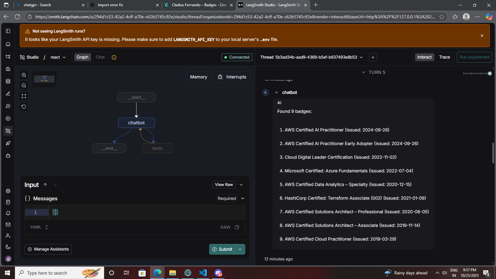
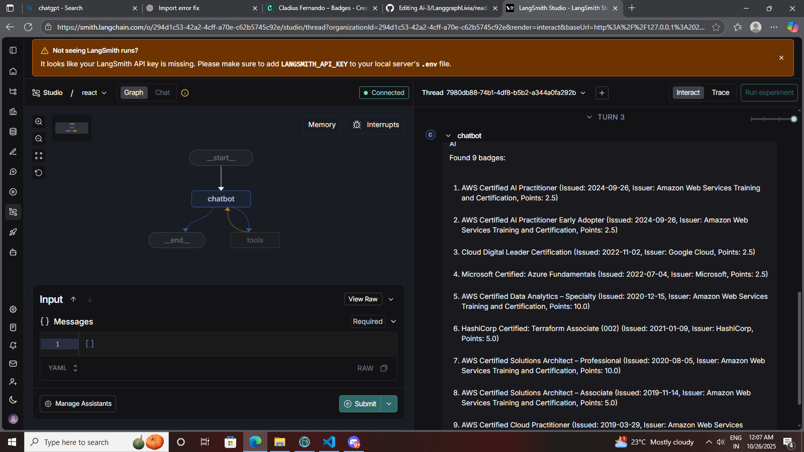

# Credly Badge Extractor

A simple Python + Playwright script that automatically fetches badge names and issued/expiry dates from any public [Credly](https://www.credly.com) profile.

---

## Features
Automatic Badge Extraction — Scrapes all badge titles and issued dates from a given Credly profile.

Headless Chrome Execution — Runs Chrome invisibly in the background.

LangGraph Agent Integration — Converts scraping into a tool node usable within LangGraph workflows.

Simple CLI Mode — Accepts a Credly URL and prints all badge details directly in your terminal.

Modular Design — Separate logic for scraping, LangGraph tools, and chatbot flow.

---

##  Requirements
Make sure you have the following installed:

- **Python 3.9 or higher**
- **Git Bash** (or any terminal)
- **Playwright** and its browsers
- **selenium**
- **langchain-core**
- **langgraph**

---

##  Project Setup
Running the Script (CLI Mode)

Simply run: python main.py

You’ll see: Enter Credly profile URL:

Paste your Credly profile URL (for example): https://www.credly.com/users/john-doe/badges

Output example:  Found 4 badges:   1. AWS Certified Solutions Architect (Issued: Mar 2024)
                                   2. Google Cloud Digital Leader (Issued: Jan 2023)
                                   3. Microsoft AI Fundamentals (Issued: Dec 2022)
                                   4. Azure Administrator Associate (Issued: Sep 2022)

##   Using with LangGraph

**Step 1: Add the tools List**

Your existing code already defines:
@tool
def get_certificates(url: str):
    return fetch_certificates(url)

tools = [get_certificates]

**Step 2: Add ToolNode to the Graph**

In your LangGraph section:

tool_node = ToolNode(tools)
graph_builder.add_node("tools", tool_node)
graph_builder.add_conditional_edges("chatbot", tools_condition)
graph_builder.add_edge("tools", "chatbot")
graph_builder.add_edge(START, "chatbot")

**Step 3: Compile the Graph**

At the end:

graph = graph_builder.compile()

Now your scraper is ready to be used in any LangGraph workflow or agentic app.

**Step 4: Test LangGraph Node**

If you’re developing within a LangGraph app (like langgraph dev), ensure your langgraph.json includes:
{
  "graphs": {
    "credly_scraper": "./main.py:graph"
  },
  "env": "./.env"
}

Then run:  langgraph dev

and you’ll see your scraper graph in the LangGraph Playground UI.

